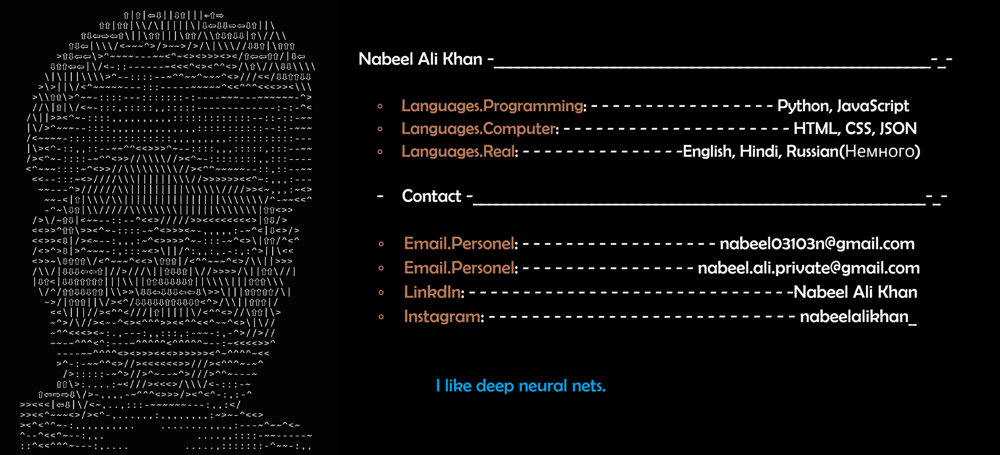

# About Me:
Hi, I'm <b>Nabeel Ali Khan</b>   I'm a software developer and AI enthusiast passionate about building practical solutions that solve real-world problems. I enjoy turning ideas into scalable products, exploring new technologies, and continuously improving my craft. Whether it's developing intelligent applications, designing reliable backend systems, or creating tools that make people's lives easier, I love building software with purpose.  I'm always learning, experimenting, and working on projects that challenge me to grow as a developer. 

# 💻 Tech Stack:
                                 

## 📈 Contribution Graph

# 📊 GitHub Stats:
 
 

### ✍️ Random Dev Quote

## 🌐 Socials:
  

<!-- Proudly created with GPRM ( https://gprm.itsvg.in ) -->
